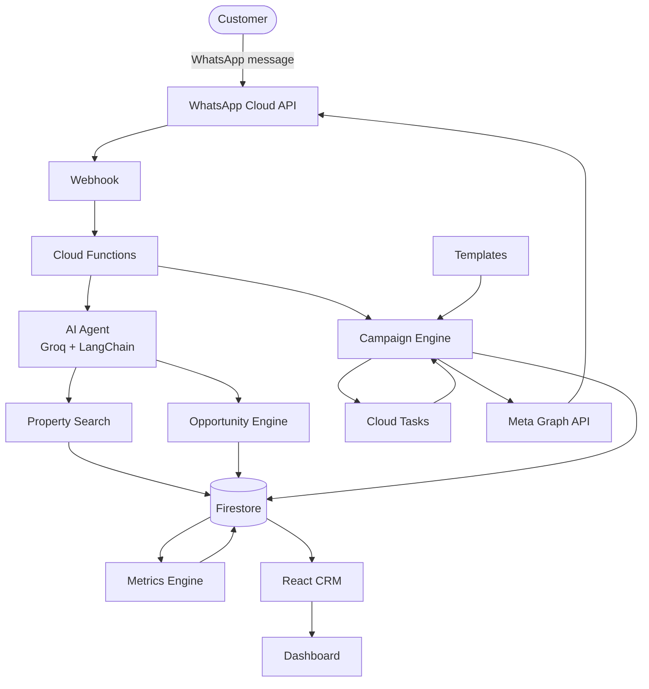

# WhatsApp Real Estate CRM

An AI-driven CRM that turns Meta Lead Ads into qualified WhatsApp conversations, runs template-based marketing campaigns, and tracks delivery, cost, and pipeline health in one dashboard — built on Firebase.


*(placeholder — full system architecture screenshot)*

**[Live Demo](#)** &nbsp;·&nbsp; **[Demo Video](#)**

---

## Project Overview

Real estate teams generate leads through Meta (Facebook/Instagram) Lead Ads, but from there the process is manual: someone has to notice the lead, message them on WhatsApp, ask qualifying questions, search listings, and log everything in a spreadsheet or CRM by hand. Most of that conversation follows a predictable pattern — budget, location, bedrooms, timeline — which is exactly the kind of thing worth automating without making the customer feel like they're talking to a script.

This project closes that loop end to end:

- A Meta Lead Ads webhook captures new leads the moment they're submitted and starts a WhatsApp conversation automatically.
- An LLM-based agent (Groq + LangChain) carries that conversation — asking qualifying questions naturally, searching the property catalog, and handing off to a human agent whenever that makes more sense.
- Every lead becomes one or more **opportunities**, each tracked through a sales pipeline, with all extracted requirements (budget, bedrooms, location, timeline, purpose) visible in one place.
- A campaign engine sends WhatsApp template broadcasts to segments of leads, with delivery/read tracking per recipient.
- A metrics engine keeps running totals — messages sent, leads captured, campaign performance, and estimated AI + WhatsApp cost — updated in real time, without ever scanning a collection to compute a number.

The result is one CRM where the AI agent, the human sales team, and the campaign tooling all work off the same lead and conversation data.

---

## Product Walkthrough

1. **A lead comes in.** Someone fills out a Facebook/Instagram Lead Ad, or a customer messages the WhatsApp number directly.
2. **The AI agent takes the first pass.** It classifies the intent of each incoming message (greeting, property search, comparing listings, booking a visit, etc.) before deciding whether to respond conversationally or search the catalog.
3. **Requirements are extracted as the conversation goes.** Budget, bedroom count, location, timeline, and purpose (end-use vs. investment) are picked up naturally over the conversation, not through a rigid form.
4. **Matching properties are searched and presented,** with the agent tracking which listings a lead has already seen so nothing is repeated.
5. **The conversation becomes a pipeline opportunity,** which a sales agent can see, follow up on, and move through pipeline stages from the CRM.
6. **A human can take over at any point.** Switching a lead to "Human Mode" silences the AI for that conversation — the agent can send messages directly from the same thread, with full context of everything the AI already discussed.
7. **Marketing campaigns can be launched** against a segment of leads using an approved WhatsApp template, with per-recipient delivery, read, and failure tracking.
8. **The dashboard updates as all of this happens** — leads, opportunities, messages, campaign performance, and estimated spend, all backed by counters that update the moment each event happens, not by periodic recomputation.

---

## Screenshots

| | |
|---|---|
|  **Dashboard** — leads, opportunities, messages, and estimated cost at a glance. |  **Campaigns** — launch, monitor, pause, and retry WhatsApp broadcasts. |
|  **Templates** — synced WhatsApp template catalog with approval status. |  **Chat CRM** — the live WhatsApp thread, AI and human messages side by side. |
|  **Smart Leads** — pipeline board of opportunities with extracted requirements. |  **Properties** — the listing catalog the AI agent searches against. |
|  **Opportunities** — a customer's individual searches, tracked separately over time. |  **Admin Dashboard** *(coming soon)* — team-level controls and permissions. |

*(all screenshots are placeholders — to be added)*

---

## System Architecture



**Flow, in words:** a customer message arrives via the WhatsApp Cloud API, hits a Cloud Functions webhook, and is handed to the AI agent, which searches properties and updates the opportunity pipeline. Campaigns run through a separate Cloud Tasks-backed engine that sends via the same Meta Graph API and reads from the synced template catalog. Every write — from a single chat turn to a campaign send — flows into Firestore, where the metrics engine keeps dashboard counters current, and the React CRM reads all of it live.

---

## Architecture Decisions

**Why Firebase?**
Cloud Functions, Firestore, and Hosting cover the whole backend — webhook handlers, background processing, a database with real-time listeners, and static hosting for the CRM — without standing up separate infrastructure for each. For a product at this scale, that trade-off (less infrastructure control, in exchange for not building and operating it) is the right one.

**Why Cloud Tasks?**
Webhooks from Meta and WhatsApp have to return a fast 200 or the sender retries and can cause duplicate processing. Cloud Tasks lets the webhook handler do the minimum (dedupe + enqueue) and return immediately, while the actual work — LLM calls, WhatsApp sends, campaign dispatch — happens asynchronously, with Cloud Tasks' own retry and backoff handling transient failures.

**Why Firestore?**
The CRM's read patterns are almost all "give me this lead" or "give me this campaign's recipients" — document-and-subcollection lookups Firestore is built for — plus real-time listeners so the CRM UI updates without polling.

**Why incremental metrics?**
Recomputing dashboard numbers by scanning collections doesn't stay cheap or fast as data grows. Every metric the dashboard shows is instead a running total moved by a small delta at the exact moment the underlying event happens (a message sent, a lead created, a campaign completed) — often inside the same Firestore transaction as that event — so rendering the dashboard is always a single document read, regardless of how much history exists behind it.

**Why delivery webhooks?**
WhatsApp's send API only confirms a message was *accepted*, not that it reached the customer. Delivery status (sent → delivered → read, or failed) comes back asynchronously via Meta's status webhook, which is what campaign recipient tracking and the dashboard's delivery metrics are actually built on.

**Why campaign lineage?**
A campaign is rarely run exactly once — the same audience and template often get relaunched. Rather than creating a new campaign document (and fragmenting that audience's history) every time, a finished campaign can be reset back to draft in place, with the previous run's results archived rather than lost.

**Why queue-based processing?**
Both incoming WhatsApp messages and campaign sends go through Cloud Tasks queues instead of being handled inline in the webhook. This decouples "acknowledge the request" from "do the work," gives each unit of work its own retry/backoff without blocking anything else, and keeps a single slow or failing send from holding up the rest of a campaign.

**Why background workers?**
Sending a WhatsApp message, waiting on the LLM, and updating Firestore all take real time — work that shouldn't happen inside a request a third party is waiting on a fast response from. Background workers (Cloud Tasks targets) pick that work up separately, so the webhook layer stays thin and fast.

**Why separate metrics collection?**
Keeping cost, delivery, and pipeline metrics in their own aggregate documents (rather than inferring them from leads/campaigns/messages on read) means the dashboard never has to know how any individual feature stores its data — it just reads counters that every feature already keeps up to date as a side effect of its normal writes.

---

## Features

**AI Agent**
- Classifies incoming message intent before deciding whether to search, answer, or hand off — the model is only given the property-search tool on turns where that intent is detected.
- Extracts qualifying details (budget, bedrooms, location, timeline, purpose) conversationally over the course of a chat, not through a rigid form.
- Never re-shows a property already presented to the same lead.

**CRM**
- Live WhatsApp thread per customer, with AI and human messages shown in the same timeline.
- Human Agent Mode: silence the AI for a conversation and reply manually, with full context preserved either way.
- A Smart Leads pipeline board and an Insights table of every lead's extracted requirements.

**Campaign Engine**
- Launch a WhatsApp template campaign against a recipient list, with pause, resume, cancel, and retry-dispatch controls.
- Per-recipient status tracking (queued → sent → delivered → read, or failed) driven by delivery webhooks.
- Campaigns can be reused in place — reset to draft with prior results archived, instead of creating a duplicate.

**Template Management**
- Syncs the full WhatsApp template catalog (status, category, quality score, rejection reason) from Meta into Firestore.
- Campaign creation is gated on a template actually being in an approved, sendable state.

**Dashboard**
- Leads, opportunities, campaigns, and message volume in one view, backed by daily/weekly/monthly aggregates.
- Recent campaign performance and an activity timeline.

**Analytics & Metrics**
- Every dashboard number is a running total updated at write time — no on-demand aggregation.
- Delivery outcomes (sent/delivered/read/failed) tracked per message and rolled up per campaign.

**Cost Tracking**
- Estimated AI cost from LLM token usage, per model, using per-token pricing.
- Estimated WhatsApp cost from Meta's per-conversation-category pricing.
- Both estimates rolled into a combined "credits used" figure for at-a-glance spend tracking.

**Opportunity Management**
- One customer can have multiple opportunities over time (a search this month, a different one next year), each tracked separately with its own shown-properties list and pipeline stage.

**Property Management**
- The listing catalog the AI agent's search tool queries against, editable from the CRM.

---

## Engineering Highlights

- **Event-driven architecture** — webhooks, Cloud Tasks, and Firestore triggers connect each stage of the pipeline; nothing polls for work.
- **Incremental metrics engine** — every dashboard counter moves by a delta at write time, frequently inside the same transaction as the event that caused it.
- **Queue-based campaign processing** — campaign sends are dispatched through Cloud Tasks in chunks, not looped through synchronously.
- **Idempotent workers** — recipients and inbound messages are claimed atomically before being processed, so Cloud Tasks' at-least-once delivery guarantee can't cause a duplicate send or duplicate reply.
- **Retry handling with real backoff** — failed sends are retried up to a fixed attempt ceiling, with permanent vs. transient failures classified explicitly rather than retried blindly.
- **Background processing** — LLM calls, WhatsApp sends, and Firestore writes all happen off the webhook's request path.
- **Firestore read optimization** — redundant per-component listeners were consolidated into a single shared context, cutting duplicate reads on the CRM's lead views.
- **WhatsApp webhook processing** — delivery status updates are matched back to the originating message and applied through an explicit, validated status transition, so an out-of-order or duplicate webhook can't corrupt tracked state.
- **Cost & credit tracking** — token usage and message volume are converted into estimated spend as they happen, not reconstructed after the fact.
- **Delivery tracking** — every WhatsApp send is followed through to delivered/read/failed via Meta's status callbacks, not assumed from the initial API response.

---

## Tech Stack

| Layer | Technology |
|---|---|
| Frontend | React 18, React Router, Vite |
| Backend | Firebase Cloud Functions (Node.js 20, 2nd gen) |
| Database | Firestore |
| AI | LangChain.js, Groq (Llama 3.3 70B / 3.1 8B) |
| Messaging | WhatsApp Cloud API, Meta Graph API |
| Infrastructure | Google Cloud Tasks, Firebase Hosting, Firebase Storage |
| Cloud | Google Cloud Platform |

---

## Folder Structure

```
functions/
  src/
    agent.js                   # LangChain agent — intent-gated property search
    intentClassifier.js        # Message intent classification
    opportunities.js           # Customer -> opportunities model
    campaigns.js                # Campaign state machine + lifecycle transitions
    campaignQueue.js            # Cloud Tasks dispatch loop for campaign sends
    processCampaignRecipient.js # Per-recipient send worker
    whatsappTemplates.js        # Template sync + campaign-eligibility checks
    whatsappWebhook.js          # Inbound messages + delivery status webhook
    metrics.js                  # Incremental dashboard metrics engine
    leadsWebhook.js              # Meta Lead Ads webhook
frontend/
  src/
    pages/                      # Dashboard, Campaigns, ChatCRM, SmartLeads, ...
    components/                 # Shared UI + dashboard widgets
    lib/                        # Client-side helpers (formatting, scoring, metrics)
```

---

## Future Roadmap

- Multi-tenancy
- Authentication
- Admin Dashboard
- Billing
- Credits (purchasable, beyond the current usage-estimate display)
- Meta Lead Ads field mapping UI
- LLM router (multi-provider, not just Groq)
- UI redesign

---

## Repository Notes

This is a showcase version of the project. Production secrets, credentials, and some environment-specific configuration have been intentionally excluded.

---

## License

This repository is shared for portfolio purposes. See [LICENSE](LICENSE) for details.
